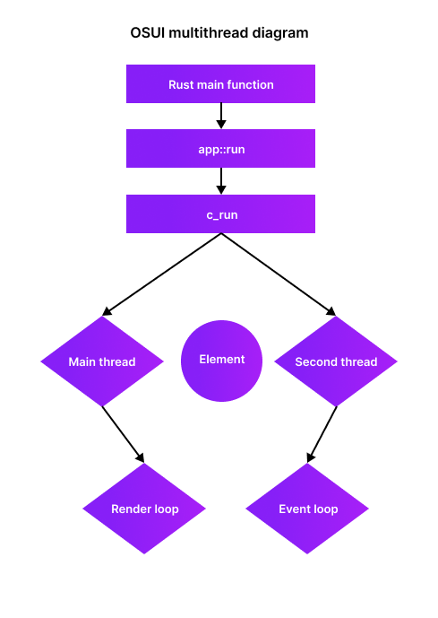

<p align="center">
  
</p>

<p align="center">
  <a href="https://crates.io/crates/osui">
  
  </a>
  <a href="https://github.com/osui-rs">
    
  </a>
  <a href="https://github.com/osui-rs/osui">
    
  </a>
</p>

<p align="center">
  <b>OSUI is a customizable terminal user interface (TUI) library written in Rust. It provides a set of components and rsx to build interactive command-line interfaces with ease.</b>
</p>

## Features

- Custom rsx syntax.
- Define and manage UI components.
- Handle keyboard input seamlessly.
- Create complex layouts using nested elements.
- Customizable element sizes and styles.

## Getting Started

To use OSUI in your project, include it in your `Cargo.toml`:

```toml
[dependencies]
osui = "0.2"  # Replace with the latest version
```

## Example Usage

Here’s a simple example of how to create a basic UI with OSUI:

```rust
use osui::prelude::*;

fn main() {
    run(&mut rsx! {
        text { "Hello, World!" }
    });
}
```

## How it works
Credit to priz.js (discord) for the idea of using C for multithreading


## Contributing

Contributions are welcome! If you have suggestions or improvements, feel free to submit a pull request or open an issue.

## License

This project is licensed under the Apache License 2.0. See the LICENSE file for details.
